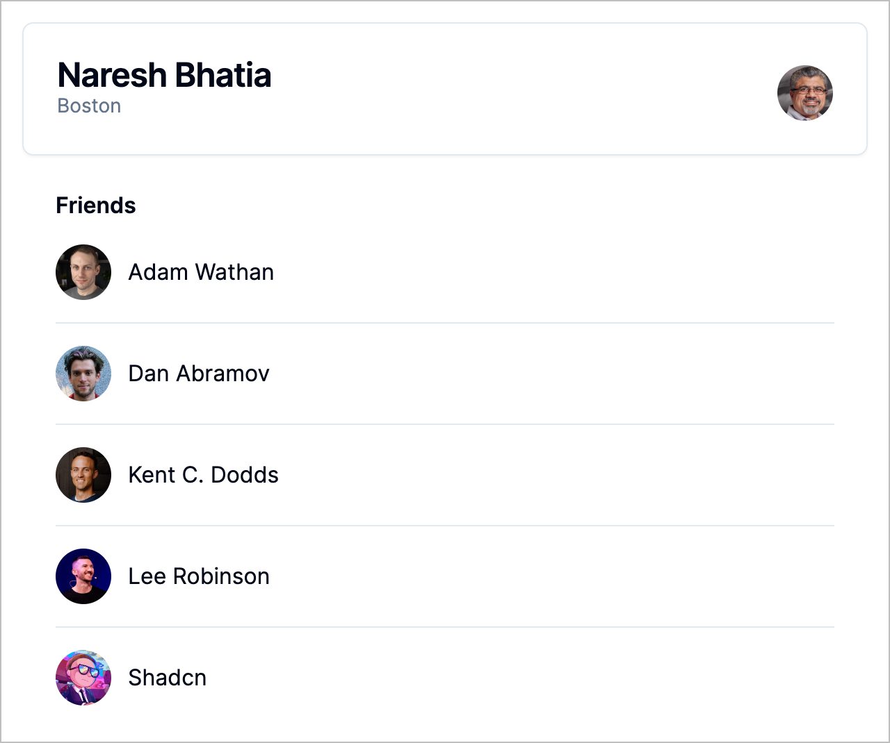

# GraphQL Fragments Example 1

A sample application to demonstrate the use of GraphQL fragments. The example is
based on the article
[Unleash the power of Fragments with GraphQL Codegen](https://the-guild.dev/blog/unleash-the-power-of-fragments-with-graphql-codegen).
I have used the naming conventions suggested in
[graphql-rules](https://github.com/graphql-rules/graphql-rules).



## Getting Started

### Development Build

```shell
npm ci
npm run dev
```

Open a browser window at http://localhost:3000/ to see app.

### Production Build

```shell
npm ci
npm run build
npm start
```

Open a browser window at http://localhost:3000/ to see app.
